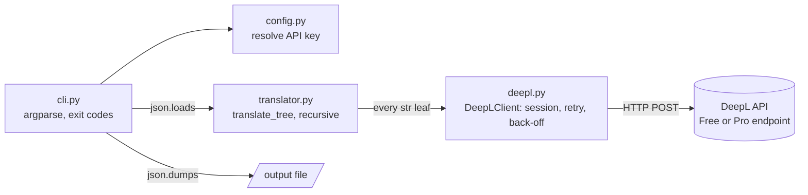

# I18nWebsiteAutoTranslator

> A command-line tool that turns a JSON i18n resource file into other languages with the [DeepL API](https://www.deepl.com/docs-api), keeping the key tree intact — for frontend teams (Angular, `react-i18next`, Flutter ARB…) who want static translation files generated once, at build time.

[](https://github.com/vincent-agi/I18nWebsiteAutoTranslator/actions/workflows/ci.yml)

<!-- TODO Vincent : optional 10 s GIF/terminal capture of `i18n-translate` translating examples/fr.json. -->

**Status:** <!-- TODO Vincent : confirm status (active | stable | archived). Version 1.0.0, last commits Sept 2026. --> — **License:** AGPL-3.0-or-later

```
en.json  ──(DeepL)──▶  fr.json / es.json / de.json …
  keys preserved, only string values translated
```

---

## 1. Why this project exists

- **Problem:** maintaining translation JSON files by hand means keeping the same key tree in every language, chasing missing keys, pasting translations one by one, and repeating it each time the source text changes. Calling a translation API at runtime for content that rarely changes is costly, slow, fragile (third-party dependency) and non-deterministic.
- **Who it's for:** developers of multilingual frontends and showcase sites with stable content (menus, landing pages, UI labels, legal notices).
- **Intent:** translate **once, at build time**, and ship a static, versioned resource file. "Done" means a file with exactly the same keys as the source and no corrupted output, even when DeepL has a hiccup.

### Features

- Translate one JSON file into another language; every DeepL language is supported (pass the code to `--source-lang` / `--target-lang`, see the [DeepL docs](https://www.deepl.com/docs-api/translate-text)).
- Key structure preserved; only string **values** are translated. Numbers, booleans and `null` pass through untouched.
- Free vs. Pro endpoint auto-selected from the key (`:fx` suffix = Free).
- Transient errors (HTTP 429 / 5xx, network drops) are retried with back-off; on a hard failure the original string is kept, so the output file is never corrupted.
- Pure CLI: drops into any script, CI job or quality pipeline. Also available as a Docker image.

## 2. Architecture & technical choices



| Decision | Why | Alternative considered |
|---|---|---|
| Generate static files at build time ([`docs/metier.md`](docs/metier.md)) | One-off cost, no latency, works offline, frozen and versioned result | Runtime API calls: costly, slow, fragile, non-deterministic |
| On failure, keep the source string instead of failing the whole run ([`docs/technique.md`](docs/technique.md)) | A partial failure must never corrupt the output file | <!-- TODO Vincent : alternative (fail fast) not discussed in the docs --> |
| Retry 429 / 5xx and network errors with linear back-off (defaults: 15 s timeout, 3 retries) | DeepL rate limits and transient failures are expected | Give up on the first error |
| API key resolved in order: `--api-key`, `DEEPL_API_KEY`, then `deepl-key.json` | Explicit beats ambient; the key file is git-ignored | — |
| `Authorization: DeepL-Auth-Key` header | Method recommended by DeepL | The legacy `auth_key` request parameter |
| `SupportsTranslate` protocol injected into `translate_tree` | Tests use a fake client; no network or API key needed | — |
| Installable package with `src/` layout and a `i18n-translate` entry point | Standard tooling (pip, hatchling, ruff, pytest); the old `main.py` stays as a deprecated shim | The initial single-script layout |
| Small multi-stage Docker image, non-root, published to GHCR | Run without a Python setup; throwaway container | — |

**Stack:** Python 3.9+, `requests`, hatchling, pytest, responses, ruff. Docker (multi-stage, Python slim).

**Repository layout:**
```
src/i18n_translator/
  cli.py          # argument parsing, orchestration, exit codes
  config.py       # API key resolution
  deepl.py        # HTTP client: endpoints, auth, retry/back-off
  translator.py   # recursive walk of the JSON structure
  errors.py       # exception hierarchy
main.py           # deprecated compatibility shim
tests/            # pytest suite, fully mocked
examples/         # sample JSON files (fr / en / es)
scripts/          # i18n-translate-docker.sh helper
docs/             # user, business and technical docs (French)
```

**Quality:** 26 unit tests, fully mocked (no network, no API key); `ruff` lint. [CI](.github/workflows/ci.yml) runs lint and tests on Python 3.9 to 3.13; a [Docker workflow](.github/workflows/docker.yml) builds the image and publishes it on pushes.

Documentation (French): [`docs/utilisateur.md`](docs/utilisateur.md) (user guide), [`docs/metier.md`](docs/metier.md) (business), [`docs/technique.md`](docs/technique.md) (technical).

## 3. Quickstart

**Prerequisites:** Python 3.9+ and a DeepL API key (a [free account](https://www.deepl.com/pro-api) gives 500 000 characters per month).

```bash
git clone https://github.com/vincent-agi/I18nWebsiteAutoTranslator.git
cd I18nWebsiteAutoTranslator

python -m venv .venv
source .venv/bin/activate            # Windows: .venv\Scripts\activate

pip install -e .                     # add "[dev]" to also get the test tools
export DEEPL_API_KEY=<your key>

# Translate the French sample menu into English
i18n-translate --source-lang FR --target-lang EN \
  --input-file examples/fr.json --output-file examples/fr.en.json

pip install -e ".[dev]"
pytest -q            # unit tests, fully mocked
ruff check .         # lint
```

Configuration: copy `deepl-key.json.example` to `deepl-key.json` and put your key in it if you prefer a file (it is git-ignored, never commit your key).

### Configure the API key

Pick **one** of these (checked in this order):

| Method | How |
| --- | --- |
| CLI flag | `--api-key <key>` |
| Environment variable | `export DEEPL_API_KEY=<key>` |
| Key file | copy `deepl-key.json.example` to `deepl-key.json`, put your key in it |

### Usage

```bash
# Short flags
i18n-translate -s EN -t IT -i examples/en.json -o examples/en.it.json

# Help / version
i18n-translate --help
i18n-translate --version
```

Also runnable as `python -m i18n_translator …`. The legacy `python main.py …` entry point still works (deprecated shim) and accepts the old `--origin-lang` alias.

| Option | Description |
| --- | --- |
| `-s`, `--source-lang` | Source language code (e.g. `FR`). Alias: `--origin-lang`. |
| `-t`, `--target-lang` | Target language code (e.g. `EN`, `ES`, `DE`). |
| `-i`, `--input-file` | Path to the source JSON file. |
| `-o`, `--output-file` | Path to write the translated JSON file (parent dirs are created). |
| `--api-key` | DeepL API key; overrides the env var and key file. |
| `--key-file` | Key-file path (default `./deepl-key.json`). |
| `--indent` | Output JSON indentation (default `4`). |
| `-v`, `--verbose` | Debug logging. |

### Docker

The tool ships as a small multi-stage image (Python slim + an isolated venv, non-root, no build tools in the final layer). Published on every push:

- **GHCR:** `ghcr.io/vincent-agi/i18nwebsiteautotranslator`
- **Docker Hub:** `vincentagi/i18n-translator` *(when the `DOCKERHUB_USERNAME` repo variable and `DOCKERHUB_TOKEN` secret are set)*

Tags: `latest` (default branch), plus `X`, `X.Y`, `X.Y.Z` on `vX.Y.Z` git tags.

One-shot run (throwaway container). `--rm` removes the container the moment it exits; mount the directory that holds your JSON files at `/work` and use paths relative to it:

```bash
docker run --rm \
  -e DEEPL_API_KEY \
  -v "$PWD":/work \
  ghcr.io/vincent-agi/i18nwebsiteautotranslator:latest \
  -s FR -t EN -i examples/fr.json -o examples/fr.en.json
```

The key can also come from a `deepl-key.json` in the mounted directory instead of `-e DEEPL_API_KEY`. Add `--user "$(id -u):$(id -g)"` so the output file is owned by you and not by root.

Helper script (run + cleanup): `scripts/i18n-translate-docker.sh` wraps the above. It runs as your host uid/gid by default, and `--cleanup` removes the image and prunes dangling layers afterwards.

```bash
DEEPL_API_KEY=xxx scripts/i18n-translate-docker.sh -- \
  -s FR -t EN -i examples/fr.json -o examples/fr.en.json

# translate, then drop the image + dangling layers
DEEPL_API_KEY=xxx scripts/i18n-translate-docker.sh --cleanup -- \
  -s EN -t DE -i en.json -o de.json
```

Override the image with `I18N_TRANSLATE_IMAGE`, the mounted dir with `I18N_TRANSLATE_WORKDIR`. `scripts/i18n-translate-docker.sh --help` lists it all. Build locally with `docker build -t i18n-translator .`.

> **Disclaimer.** Machine translation is not perfect. **Review every generated file** before shipping it. You are responsible for your use of this tool and of the DeepL API.

## 4. Lessons learned

<!-- TODO Vincent : these are leads inferred from the code, docs and git history. Rewrite in your own voice or delete. -->

- **What this project validated:** <!-- TODO Vincent : lead — a small, well-bounded tool (about 360 lines of Python across 7 modules) with a protocol-injected client stays fully testable offline: 26 tests, no network. -->
- **What was harder than expected:** <!-- TODO Vincent : lead — the history shows a first version, then fixes for translating complex elements (PR #2), then a restructuring into an installable package (d63bc65); handling partial DeepL failures without corrupting the output is a documented design principle. -->
- **What I'd do differently today:** <!-- TODO Vincent : lead — start from the package layout and CI directly instead of a single script; the deprecated `main.py` shim and `--origin-lang` alias exist only for backward compatibility. -->
- **Next steps / roadmap:** <!-- TODO Vincent : your call — translations are sent string by string (one request per leaf); batching or caching unchanged keys are possible directions, not stated in the repo. -->

---

## Contributing

Issues and PRs welcome. Commits follow [Conventional Commits](https://www.conventionalcommits.org/). <!-- TODO Vincent : there is no CONTRIBUTING.md in this repo; add one or keep this line. -->

## About

Built by [Vincent AGI](https://vincent-agi.fr) — software engineer & mentor. Licensed under the GNU Affero General Public License v3.0 or later, see [`LICENSE`](LICENSE).
